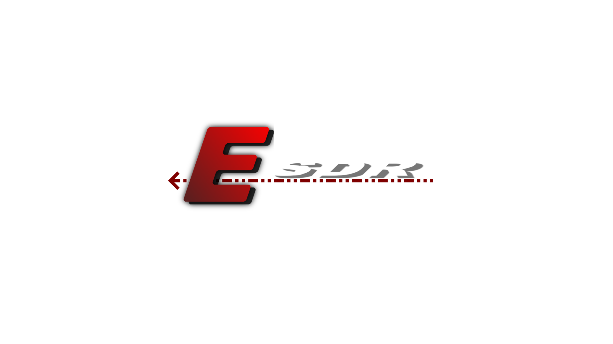

# ESDR



Everything Software Defined Radio. Has all the tools and needs for radio that can be implemented

## RTL-SDR source implementation (current)
- `RTLSDRBackend` is implemented in `esdr-gdextention-source/src` and uses SoapySDR.
- Graph node classes are native C++ classes in `esdr-gdextention-source/src`:
  - `SDR` (base graph node)
  - `RTLSDRSource` (RTL source node)
  - `NFMDemodulator` (NFM module node)
- Graph elements are instantiated through the app graph UI (not as GDScript `class_name` classes).

## Build native extension
```bash
git submodule update --init --recursive
cd esdr-gdextention-source/radio-libs/SoapySDR
cmake -S . -B build -DCMAKE_BUILD_TYPE=Release -DCMAKE_INSTALL_PREFIX=../../radio-install
cmake --build build -j
cmake --install build

cd esdr-gdextention-source
cmake -S . -B build
cmake --build build -j
```

Build output is placed in `bin/` at the project root so `res://esdr.gdextension` can load it.

Radio libraries are vendored under `esdr-gdextention-source/radio-libs/`.

## GDExtension details (merged)
This section is merged from `esdr-gdextention-source/README.md`.

### Current module
- `RTLSDRBackend` (SoapySDR-based IQ source backend)
- `SDR` (base graph node class)
- `RTLSDRSource` (RTL source graph node class)
- `NFMDemodulator` (NFM graph node class)
- Graph node classes are registered as internal extension classes and spawned by the graph UI.

### Vendored radio libs
- `radio-libs/SoapySDR`
- `radio-libs/SoapyRTLSDR`
- `radio-libs/rtl-sdr`
- `radio-libs/liquid-dsp`
- `radio-libs/volk`

### Build prerequisites
- Godot 4.2+
- CMake 3.20+
- A local `godot-cpp` checkout built from the same major/minor as your Godot editor
- SoapySDR development package (optional but required for real hardware capture)

### Build (Linux/macOS)
```bash
cd ..
git submodule update --init --recursive

cd esdr-gdextention-source/radio-libs/SoapySDR
cmake -S . -B build -DCMAKE_BUILD_TYPE=Release -DCMAKE_INSTALL_PREFIX=../../radio-install
cmake --build build -j
cmake --install build

cd esdr-gdextention-source
cmake -S . -B build
cmake --build build -j
```

If you need to override `godot-cpp`, pass `-DGODOT_CPP_PATH=/absolute/path/to/godot-cpp`.

```bash
cd esdr-gdextention-source
cmake -S . -B build -DGODOT_CPP_PATH=/absolute/path/to/godot-cpp
cmake --build build -j
```

The output library is placed in `bin/` at project root and loaded by `res://esdr.gdextension`.

### Notes
- If SoapySDR is missing, the extension still builds, but `RTLSDRBackend.start()` returns `false` with an error string.
- `driver` defaults to `rtlsdr`, and `device_args` accepts comma-separated `key=value` pairs.
- Building `rtl-sdr` from source requires system `libusb-1.0` development headers.
